# ML2 benchmark:
ML2: L2 resident (depending on LFSR settings) linked list traversal

## Greedy

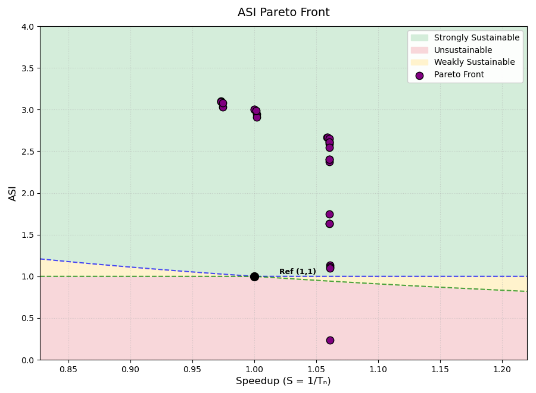

**Result:**

Total sniper runs: 781
Final hypervolume: 3.2594

**Front:**

| bpt | bp | l1da | l1d | l1ia | l1i | l2a | l2 | l3a | l3 | nhist | robc | robd | robw | ASI | Speedup | Area | PeakPow | Region |
|---|---|---|---|---|---|---|---|---|---|---|---|---|---|---|---|---|---|---|
| a53 | | 4 | 64 | | | | 512 | | 2048 | 4 | | | 1024 | 0.2323 | 1.0610 | 67.94 | 141.87 | Unsustainable |
| pentium_m | | 4 | 64 | 8 | 16 | | 512 | | 1024 | | 8 | 2 | 1024 | 1.1008 | 1.0610 | 49.33 | 34.59 | Strongly Sust. |
| pentium_m | | 4 | 64 | 8 | | | 512 | 4 | 1024 | | 2 | 2 | 1024 | 1.1154 | 1.0609 | 47.61 | 34.56 | Strongly Sust. |
| pentium_m | | 4 | 64 | | | | 512 | | 1024 | | | 2 | 1024 | 1.1342 | 1.0608 | 47.96 | 33.90 | Strongly Sust. |
| a53 | | | 64 | | | | 512 | | 2048 | | 2 | | | 1.6355 | 1.0608 | 55.79 | 22.20 | Strongly Sust. |
| a53 | 512 | | 64 | | | | 512 | | 2048 | | 2 | | | 1.6355 | 1.0608 | 55.79 | 22.20 | Strongly Sust. |
| a53 | | | 64 | | | | 512 | | 2048 | | | | 16 | 1.7450 | 1.0607 | 55.19 | 20.90 | Strongly Sust. |
| a53 | 512 | | 64 | | | | 512 | | 1024 | | | 2 | | 2.3749 | 1.0607 | 47.80 | 16.21 | Strongly Sust. |
| pentium_m | | 4 | 64 | 8 | | | 512 | | 1024 | | | 2 | 64 | 2.4038 | 1.0607 | 45.04 | 16.33 | Strongly Sust. |
| a53 | 512 | 4 | 64 | 8 | | | 512 | | 1024 | | | 2 | 64 | 2.4038 | 1.0606 | 45.04 | 16.33 | Strongly Sust. |
| a53 | 512 | 4 | 64 | | | | 512 | | 1024 | | | 2 | 64 | 2.5447 | 1.0606 | 43.32 | 15.61 | Strongly Sust. |
| a53 | | 4 | 64 | | | | 512 | 8 | 1024 | | | 2 | 64 | 2.5897 | 1.0606 | 41.24 | 15.56 | Strongly Sust. |
| a53 | 512 | 4 | 64 | | | | 512 | | 1024 | | | 2 | 16 | 2.6083 | 1.0606 | 43.17 | 15.25 | Strongly Sust. |
| a53 | | 4 | 64 | | | | 512 | | 1024 | | | 2 | 16 | 2.6083 | 1.0605 | 43.17 | 15.25 | Strongly Sust. |
| a53 | | 4 | 64 | | | | 512 | 8 | 1024 | | | 2 | 16 | 2.6546 | 1.0605 | 41.09 | 15.19 | Strongly Sust. |
| a53 | | 4 | | | | | 512 | 8 | 1024 | | | 2 | 16 | 2.6666 | 1.0589 | 40.92 | 15.14 | Strongly Sust. |
| a53 | | 4 | | | | | 512 | 4 | 1024 | | | 2 | 16 | 2.6682 | 1.0589 | 40.92 | 15.13 | Strongly Sust. |
| a53 | | 4 | 64 | | | 4 | | | 1024 | | | 2 | 32 | 2.9076 | 1.0019 | 36.49 | 14.31 | Strongly Sust. |
| a53 | | 4 | 64 | | | 4 | | | 1024 | | | 2 | 16 | 2.9477 | 1.0018 | 36.40 | 14.12 | Strongly Sust. |
| a53 | | 4 | 64 | | | | | 8 | 1024 | | | 2 | 16 | 2.9861 | 1.0013 | 34.86 | 14.08 | Strongly Sust. |
| a53 | | 4 | | | | | | 8 | 1024 | | | 2 | 16 | 3.0002 | 0.9999 | 34.69 | 14.03 | Strongly Sust. |
| a53 | | 4 | | | | | | 4 | 1024 | | | 2 | 16 | 3.0022 | 0.9999 | 34.69 | 14.02 | Strongly Sust. |
| a53 | | 4 | 64 | | | 4 | 128 | | 1024 | | | 2 | 16 | 3.0325 | 0.9746 | 35.43 | 13.81 | Strongly Sust. |
| a53 | | 4 | 64 | | | | 128 | 8 | 1024 | | | 2 | 16 | 3.0823 | 0.9744 | 33.37 | 13.77 | Strongly Sust. |
| a53 | | 4 | | | | | 128 | 8 | 1024 | | | 2 | 16 | 3.0970 | 0.9732 | 33.20 | 13.72 | Strongly Sust. |
| a53 | | 4 | | | | | 128 | 4 | 1024 | | | 2 | 16 | 3.0991 | 0.9731 | 33.20 | 13.71 | Strongly Sust. |

## SPEA2 - COLE

### hyperparameter settings 1
Hyperparameter settings: Patience = 1 (amount of iterations to wait before stopping after no improvement), max_iterations: int = 10. (max iter never reached)

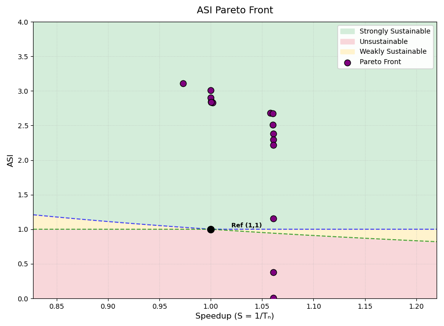

**Result:**

Total sniper runs: 237
Final hypervolume: 3.2693

**Front:**

| bpt | bp | l1da | l1d | l1ia | l1i | l2a | l2 | l3a | l3 | nhist | robc | robd | robw | ASI | Speedup | Area | PeakPow | Region |
|---|---|---|---|---|---|---|---|---|---|---|---|---|---|---|---|---|---|---|
| a53 | 1024 | 4 | 64 | 8 | 16 | 8 | 512 | 16 | 1024 | 3 | 2 | 8 | 1024 | 0.0070 | 1.0608 | 157.56 | 1188.00 | Unsustainable |
| pentium_m | | 8 | 64 | 4 | 16 | 8 | 512 | 16 | 1024 | | 2 | 4 | 512 | 0.3748 | 1.0608 | 57.72 | 95.43 | Unsustainable |
| pentium_m | | 4 | 64 | 4 | 16 | 8 | 512 | 4 | 1024 | | 2 | 2 | 1024 | 1.1558 | 1.0608 | 45.64 | 33.82 | Strongly Sust. |
| pentium_m | | 4 | 64 | 8 | 64 | 4 | 512 | 8 | 2048 | | 4 | 2 | 256 | 2.2207 | 1.0607 | 48.56 | 17.24 | Strongly Sust. |
| tage | | 4 | 64 | 8 | 16 | 8 | 512 | 4 | 2048 | | 10 | 2 | 16 | 2.2940 | 1.0607 | 49.42 | 16.59 | Strongly Sust. |
| pentium_m | | 4 | 64 | 4 | 32 | 8 | 512 | 16 | 2048 | | 4 | 2 | 32 | 2.3800 | 1.0606 | 48.12 | 16.14 | Strongly Sust. |
| pentium_m | | 4 | 64 | 8 | 64 | 8 | 512 | 4 | 1024 | | 10 | 2 | 16 | 2.5075 | 1.0605 | 43.13 | 15.86 | Strongly Sust. |
| tage | | 4 | 64 | 4 | 16 | 4 | 512 | 4 | 1024 | | 8 | 2 | 16 | 2.6748 | 1.0605 | 40.76 | 15.11 | Strongly Sust. |
| tage | | 4 | 16 | 4 | 32 | 8 | 512 | 4 | 1024 | | 4 | 2 | 16 | 2.6778 | 1.0581 | 40.73 | 15.10 | Strongly Sust. |
| pentium_m | | 4 | 64 | 8 | 64 | 4 | 256 | 8 | 1024 | | 2 | 2 | 16 | 2.8286 | 1.0018 | 36.35 | 14.72 | Strongly Sust. |
| pentium_m | | 4 | 32 | 8 | 64 | 4 | 256 | 8 | 1024 | | 10 | 2 | 16 | 2.8417 | 1.0004 | 36.18 | 14.67 | Strongly Sust. |
| pentium_m | | 4 | 32 | 8 | 64 | 4 | 256 | 8 | 1024 | | 10 | 2 | 16 | 2.8417 | 1.0004 | 36.18 | 14.67 | Strongly Sust. |
| pentium_m | | 4 | 32 | 8 | 16 | 4 | 256 | 4 | 1024 | | 10 | 2 | 16 | 2.8550 | 1.0003 | 35.52 | 14.66 | Strongly Sust. |
| pentium_m | | 4 | 32 | 4 | 16 | 8 | 256 | 4 | 1024 | | 10 | 2 | 128 | 2.9034 | 1.0000 | 34.66 | 14.50 | Strongly Sust. |
| pentium_m | | 4 | 32 | 4 | 16 | 8 | 256 | 4 | 1024 | | 2 | 2 | 16 | 3.0118 | 0.9999 | 34.45 | 14.00 | Strongly Sust. |
| pentium_m | | 4 | 32 | 4 | 16 | 8 | 128 | 4 | 1024 | | 2 | 2 | 16 | 3.1091 | 0.9731 | 32.96 | 13.69 | Strongly Sust. |

## Max-value Entropy Search for Multi-objective Bayesian Optimization (MESMO)
source: https://arxiv.org/pdf/2110.06980
### hyperparameter settings 1
Hyperparameter settings: 400 candidate samples (400 candidate configurations are considered per iteration; each is scored by the information gained, averaged over a default of 10 Monte Carlo posterior-function samples (amount is hyperparameter, default is 10), and the top-scoring one (also hyperparameter, default is 1) is evaluated.) are used and 7 initial configurations (including baseline, always the case!) have been run.

#### 20 iterations
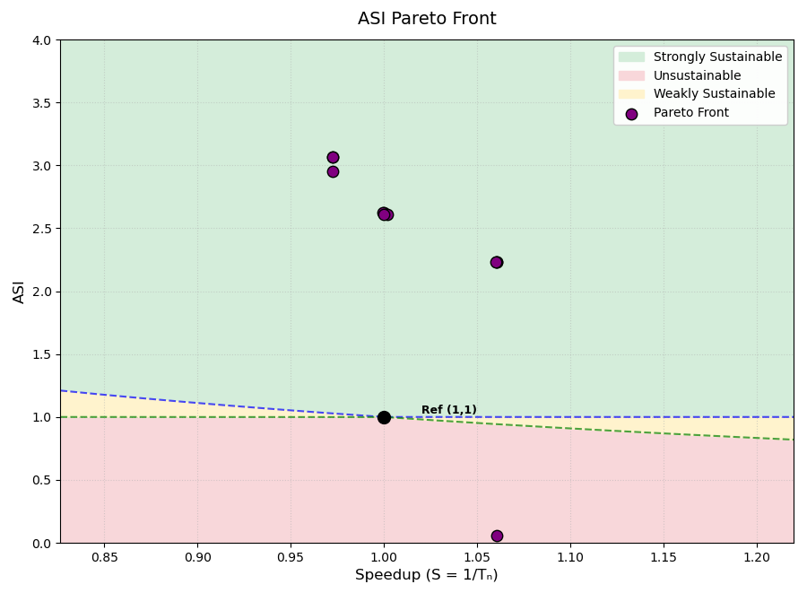

**Result:**

Total sniper runs: 26
Final hypervolume: 3.1908

**Front:**

| bpt | bp | l1da | l1d | l1ia | l1i | l2a | l2 | l3a | l3 | nhist | nnbl | nnlr | robc | robd | robw | ASI | Speedup | Area | PeakPow | Region |
|---|---|---|---|---|---|---|---|---|---|---|---|---|---|---|---|---|---|---|---|---|
| pentium_m | | 8 | 64 | 8 | 16 | 8 | 512 | 16 | 1024 | | | | 10 | 8 | 256 | 0.0537 | 1.0608 | 83.61 | 533.35 | Unsustainable |
| a53 | 512 | 8 | 64 | 8 | 16 | 8 | 512 | 16 | 1024 | 2 | | | 10 | 2 | 256 | 2.2291 | 1.0606 | 49.29 | 17.09 | Strongly Sust. |
| pentium_m | | 8 | 64 | 8 | 16 | 8 | 512 | 16 | 1024 | | | | 10 | 2 | 256 | 2.2292 | 1.0605 | 49.29 | 17.08 | Strongly Sust. |
| nn | | 8 | 64 | 8 | 16 | 8 | 512 | 16 | 1024 | | 16 | 0.005 | 10 | 2 | 256 | 2.2293 | 1.0602 | 49.29 | 17.08 | Strongly Sust. |
| a53 | 512 | 4 | 64 | 4 | 16 | 4 | 256 | 4 | 2048 | 4 | | | 2 | 2 | 256 | 2.6064 | 1.0018 | 41.36 | 15.45 | Strongly Sust. |
| nn | | 4 | 64 | 4 | 16 | 4 | 256 | 4 | 2048 | | 16 | 0.0005 | 2 | 2 | 256 | 2.6071 | 1.0001 | 41.36 | 15.44 | Strongly Sust. |
| pentium_m | | 4 | 16 | 4 | 16 | 4 | 256 | 4 | 2048 | | | | 2 | 2 | 256 | 2.6273 | 0.9999 | 40.99 | 15.36 | Strongly Sust. |
| a53 | 512 | 4 | 16 | 4 | 16 | 4 | 256 | 4 | 2048 | 4 | | | 2 | 2 | 256 | 2.6273 | 0.9997 | 40.99 | 15.36 | Strongly Sust. |
| a53 | 512 | 4 | 16 | 4 | 32 | 8 | 128 | 4 | 1024 | 4 | | | 2 | 2 | 256 | 2.9545 | 0.9724 | 33.33 | 14.37 | Strongly Sust. |
| a53 | 512 | 4 | 16 | 4 | 32 | 8 | 128 | 4 | 1024 | 4 | | | 4 | 2 | 32 | 3.0672 | 0.9723 | 33.09 | 13.87 | Strongly Sust. |
| a53 | 512 | 4 | 16 | 4 | 32 | 8 | 128 | 4 | 1024 | 4 | | | 2 | 2 | 32 | 3.0672 | 0.9723 | 33.09 | 13.87 | Strongly Sust. |

### 60 iterations
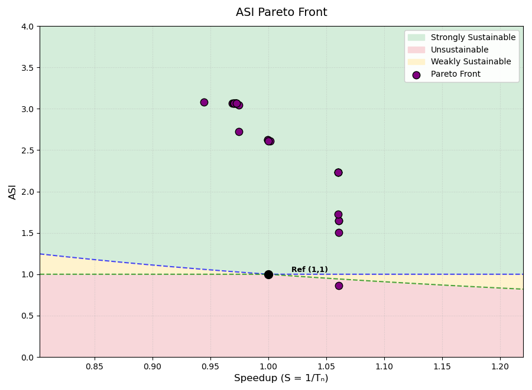

**Result:**

Total sniper runs: 66
Final hypervolume: 3.2056

**Front:**

| bpt | bp | l1da | l1d | l1ia | l1i | l2a | l2 | l3a | l3 | nhist | nnbl | nnlr | robc | robd | robw | ASI | Speedup | Area | PeakPow | Region |
|---|---|---|---|---|---|---|---|---|---|---|---|---|---|---|---|---|---|---|---|---|
| pentium_m | | 8 | 64 | 8 | 16 | 4 | 512 | 8 | 4096 | | | | 10 | 2 | 1024 | 0.8626 | 1.0609 | 70.94 | 37.26 | Unsustainable |
| pentium_m | | 8 | 64 | 8 | 16 | 8 | 512 | 16 | 1024 | | | | 10 | 2 | 512 | 1.5034 | 1.0608 | 50.78 | 25.06 | Strongly Sust. |
| pentium_m | | 4 | 64 | 8 | 64 | 8 | 512 | 16 | 2048 | | | | 10 | 4 | 128 | 1.6488 | 1.0608 | 53.40 | 22.41 | Strongly Sust. |
| pentium_m | | 4 | 64 | 8 | 64 | 8 | 512 | 16 | 2048 | | | | 8 | 4 | 128 | 1.6488 | 1.0607 | 53.40 | 22.41 | Strongly Sust. |
| a53 | 512 | 8 | 64 | 8 | 16 | 8 | 512 | 16 | 4096 | 2 | | | 10 | 2 | 256 | 1.7280 | 1.0606 | 66.19 | 19.35 | Strongly Sust. |
| a53 | 512 | 8 | 64 | 8 | 16 | 8 | 512 | 16 | 1024 | 2 | | | 10 | 2 | 256 | 2.2291 | 1.0606 | 49.29 | 17.09 | Strongly Sust. |
| pentium_m | | 8 | 64 | 8 | 16 | 8 | 512 | 16 | 1024 | | | | 10 | 2 | 256 | 2.2292 | 1.0605 | 49.29 | 17.08 | Strongly Sust. |
| nn | | 8 | 64 | 8 | 16 | 8 | 512 | 16 | 1024 | | 16 | 0.005 | 10 | 2 | 256 | 2.2293 | 1.0602 | 49.29 | 17.08 | Strongly Sust. |
| a53 | 512 | 4 | 64 | 4 | 16 | 4 | 256 | 4 | 2048 | 4 | | | 2 | 2 | 256 | 2.6064 | 1.0018 | 41.36 | 15.45 | Strongly Sust. |
| nn | | 4 | 64 | 4 | 16 | 4 | 256 | 4 | 2048 | | 16 | 0.0005 | 2 | 2 | 256 | 2.6071 | 1.0001 | 41.36 | 15.44 | Strongly Sust. |
| pentium_m | | 4 | 16 | 4 | 16 | 4 | 256 | 4 | 2048 | | | | 2 | 2 | 256 | 2.6273 | 0.9999 | 40.99 | 15.36 | Strongly Sust. |
| a53 | 512 | 4 | 16 | 4 | 16 | 4 | 256 | 4 | 2048 | 4 | | | 2 | 2 | 256 | 2.6273 | 0.9997 | 40.99 | 15.36 | Strongly Sust. |
| tage | | 4 | 64 | 4 | 32 | 4 | 128 | 16 | 2048 | | | | 4 | 2 | 64 | 2.7216 | 0.9747 | 40.44 | 14.89 | Strongly Sust. |
| nn | | 4 | 64 | 4 | 32 | 8 | 128 | 4 | 1024 | | 64 | 0.0005 | 8 | 2 | 32 | 3.0414 | 0.9746 | 33.46 | 13.95 | Strongly Sust. |
| a53 | 512 | 4 | 16 | 4 | 32 | 8 | 128 | 4 | 1024 | 3 | | | 8 | 2 | 32 | 3.0671 | 0.9725 | 33.09 | 13.87 | Strongly Sust. |
| a53 | 512 | 4 | 16 | 4 | 32 | 8 | 128 | 4 | 1024 | 4 | | | 10 | 2 | 32 | 3.0671 | 0.9724 | 33.09 | 13.87 | Strongly Sust. |
| tage | | 4 | 16 | 4 | 32 | 8 | 128 | 4 | 1024 | | | | 2 | 2 | 32 | 3.0672 | 0.9723 | 33.09 | 13.87 | Strongly Sust. |
| a53 | 512 | 4 | 16 | 4 | 32 | 8 | 128 | 4 | 1024 | 4 | | | 8 | 2 | 32 | 3.0672 | 0.9723 | 33.09 | 13.87 | Strongly Sust. |
| nn | | 4 | 16 | 4 | 32 | 8 | 128 | 4 | 1024 | | 16 | 0.0005 | 10 | 2 | 32 | 3.0675 | 0.9717 | 33.09 | 13.87 | Strongly Sust. |
| nn | | 4 | 16 | 4 | 32 | 8 | 128 | 4 | 1024 | | 64 | 0.005 | 2 | 2 | 32 | 3.0681 | 0.9706 | 33.09 | 13.86 | Strongly Sust. |
| nn | | 4 | 16 | 4 | 32 | 8 | 128 | 4 | 1024 | | 64 | 0.005 | 10 | 2 | 32 | 3.0682 | 0.9703 | 33.09 | 13.86 | Strongly Sust. |
| nn | | 4 | 16 | 4 | 32 | 8 | 128 | 4 | 1024 | | 32 | 0.0005 | 10 | 2 | 32 | 3.0684 | 0.9700 | 33.09 | 13.86 | Strongly Sust. |
| nn | | 4 | 16 | 4 | 32 | 8 | 128 | 4 | 1024 | | 32 | 0.0005 | 8 | 2 | 32 | 3.0688 | 0.9692 | 33.09 | 13.86 | Strongly Sust. |
| nn | | 4 | 16 | 4 | 32 | 8 | 128 | 4 | 1024 | | 64 | 0.0005 | 8 | 2 | 32 | 3.0814 | 0.9447 | 33.09 | 13.80 | Strongly Sust. |

### 200 iterations
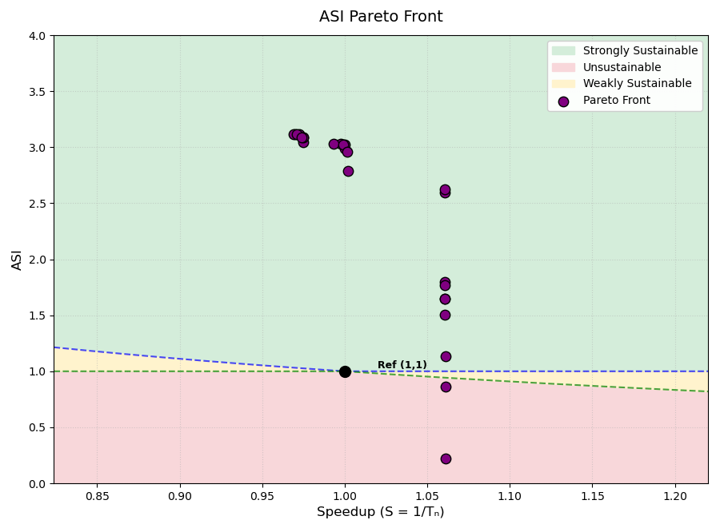

**Result:**

Total sniper runs: 206
Final hypervolume: 3.2729

**Front:**

| bpt | bp | l1da | l1d | l1ia | l1i | l2a | l2 | l3a | l3 | nhist | nnbl | nnlr | robc | robd | robw | ASI | Speedup | Area | PeakPow | Region |
|---|---|---|---|---|---|---|---|---|---|---|---|---|---|---|---|---|---|---|---|---|
| pentium_m | | 8 | 64 | 4 | 64 | 8 | 512 | 4 | 2048 | | | | 8 | 4 | 1024 | 0.2219 | 1.0609 | 72.96 | 142.35 | Unsustainable |
| pentium_m | | 8 | 64 | 8 | 16 | 4 | 512 | 8 | 4096 | | | | 10 | 2 | 1024 | 0.8626 | 1.0609 | 70.94 | 37.26 | Unsustainable |
| pentium_m | | 4 | 64 | 4 | 16 | 8 | 512 | 16 | 1024 | | | | 2 | 2 | 1024 | 1.1369 | 1.0609 | 47.72 | 33.88 | Strongly Sust. |
| pentium_m | | 8 | 64 | 8 | 16 | 8 | 512 | 16 | 1024 | | | | 10 | 2 | 512 | 1.5034 | 1.0608 | 50.78 | 25.06 | Strongly Sust. |
| pentium_m | | 4 | 64 | 8 | 64 | 8 | 512 | 16 | 2048 | | | | 10 | 4 | 128 | 1.6488 | 1.0608 | 53.40 | 22.41 | Strongly Sust. |
| pentium_m | | 4 | 64 | 8 | 64 | 8 | 512 | 16 | 2048 | | | | 8 | 4 | 128 | 1.6488 | 1.0607 | 53.40 | 22.41 | Strongly Sust. |
| pentium_m | | 8 | 64 | 8 | 64 | 8 | 512 | 16 | 4096 | | | | 8 | 2 | 32 | 1.7692 | 1.0606 | 66.61 | 18.84 | Strongly Sust. |
| pentium_m | | 4 | 64 | 8 | 32 | 8 | 512 | 16 | 1024 | | | | 8 | 4 | 64 | 1.7965 | 1.0606 | 48.05 | 21.39 | Strongly Sust. |
| pentium_m | | 4 | 64 | 4 | 16 | 8 | 512 | 8 | 1024 | | | | 10 | 2 | 64 | 2.5978 | 1.0606 | 41.00 | 15.54 | Strongly Sust. |
| nn | | 4 | 64 | 4 | 32 | 8 | 512 | 4 | 1024 | | 64 | 0.0005 | 8 | 2 | 32 | 2.6225 | 1.0606 | 41.18 | 15.37 | Strongly Sust. |
| tage | | 8 | 64 | 4 | 32 | 4 | 256 | 8 | 1024 | | | | 2 | 2 | 32 | 2.7856 | 1.0019 | 38.83 | 14.70 | Strongly Sust. |
| a53 | 2048 | 4 | 64 | 4 | 64 | 8 | 256 | 8 | 1024 | 2 | | | 4 | 2 | 16 | 2.9603 | 1.0013 | 35.45 | 14.15 | Strongly Sust. |
| nn | | 4 | 32 | 4 | 64 | 4 | 256 | 4 | 1024 | | 16 | 0.005 | 2 | 2 | 16 | 2.9891 | 1.0002 | 34.74 | 14.08 | Strongly Sust. |
| nn | | 4 | 32 | 4 | 16 | 4 | 256 | 4 | 1024 | | 16 | 0.005 | 10 | 2 | 16 | 3.0249 | 1.0002 | 33.91 | 13.99 | Strongly Sust. |
| nn | | 4 | 16 | 4 | 32 | 4 | 256 | 4 | 1024 | | 16 | 0.005 | 10 | 2 | 16 | 3.0264 | 0.9993 | 33.96 | 13.97 | Strongly Sust. |
| nn | | 4 | 16 | 4 | 32 | 4 | 256 | 4 | 1024 | | 64 | 0.005 | 10 | 2 | 16 | 3.0272 | 0.9977 | 33.96 | 13.97 | Strongly Sust. |
| nn | | 4 | 32 | 4 | 16 | 4 | 256 | 4 | 1024 | | 16 | 0.0005 | 10 | 2 | 16 | 3.0284 | 0.9932 | 33.91 | 13.97 | Strongly Sust. |
| a53 | 2048 | 4 | 64 | 4 | 32 | 4 | 128 | 4 | 1024 | 4 | | | 8 | 2 | 32 | 3.0444 | 0.9746 | 33.43 | 13.94 | Strongly Sust. |
| a53 | 2048 | 4 | 64 | 4 | 32 | 4 | 128 | 4 | 1024 | 4 | | | 8 | 2 | 16 | 3.0873 | 0.9746 | 33.35 | 13.75 | Strongly Sust. |
| a53 | 512 | 4 | 64 | 4 | 32 | 4 | 128 | 4 | 1024 | 4 | | | 8 | 2 | 16 | 3.0873 | 0.9746 | 33.35 | 13.75 | Strongly Sust. |
| nn | | 4 | 64 | 4 | 32 | 4 | 128 | 4 | 1024 | | 16 | 0.0005 | 8 | 2 | 16 | 3.0877 | 0.9738 | 33.35 | 13.75 | Strongly Sust. |
| tage | | 4 | 16 | 4 | 32 | 4 | 128 | 4 | 1024 | | | | 10 | 2 | 16 | 3.1136 | 0.9724 | 32.98 | 13.67 | Strongly Sust. |
| nn | | 4 | 16 | 4 | 32 | 4 | 128 | 4 | 1024 | | 16 | 0.001 | 10 | 2 | 16 | 3.1144 | 0.9709 | 32.98 | 13.67 | Strongly Sust. |
| nn | | 4 | 16 | 4 | 32 | 4 | 128 | 4 | 1024 | | 64 | 0.005 | 10 | 2 | 16 | 3.1149 | 0.9699 | 32.98 | 13.66 | Strongly Sust. |
| nn | | 4 | 16 | 4 | 32 | 4 | 128 | 4 | 1024 | | 64 | 0.001 | 10 | 2 | 16 | 3.1153 | 0.9692 | 32.98 | 13.66 | Strongly Sust. |

HV was already 3.2727 at iter 152 beofre that also quite slowe increase. Amount of points did increase with 10.
# ML2 and CCl benchmarks:
ML2: L2 resident (depending on LFSR settings) linked list traversal

CCl: Impossible control with large basic blocks (potentially larger penalty)
## Greedy

Became infeasable with new parameterspace.
first iteration: 33 simulations
second iteration: >100 simulations
## SPEA2 - COLE

### hyperparameter settings 1

Hyperparameter settings: Patience = 1 (amount of iterations to wait before stopping after no improvement), max_iterations: int = 30,
folowing parameters are default: num_populations: int = 3, population_size: int = 20, archive_size: int = 10, p_mutation: float = 0.10, p_crossover: float = 0.90, p_migration: float = 0.10.

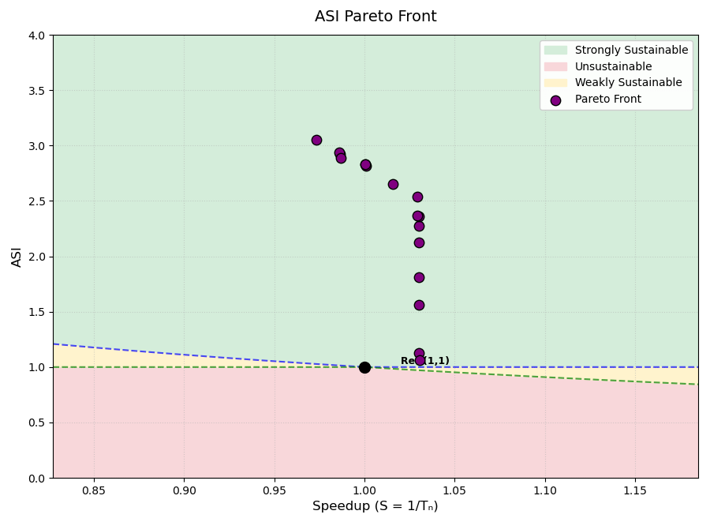

**Result:**

Total sniper runs: 246
Final hypervolume: 3.1294

**Front:**

| bpt | bp | l1da | l1d | l1ia | l1i | l2a | l2 | l3a | l3 | nhist | nnbl | nnlr | robc | robd | robw | ASI | Speedup | Area | PeakPow | Region |
|---|---|---|---|---|---|---|---|---|---|---|---|---|---|---|---|---|---|---|---|---|
| a53 | 1024 | 4 | 64 | 8 | 64 | 8 | 512 | 8 | 2048 | 3 | | | 4 | 2 | 1024 | 1.0624 | 1.0304 | 53.11 | 36.02 | Strongly Sust. |
| a53 | 1024 | 4 | 64 | 8 | 64 | 4 | 512 | 8 | 1024 | 3 | | | 4 | 2 | 1024 | 1.1281 | 1.0303 | 47.82 | 35.26 | Strongly Sust. |
| pentium_m | | 4 | 64 | 4 | 16 | 4 | 512 | 4 | 2048 | | | | 2 | 2 | 512 | 1.5617 | 1.0302 | 49.53 | 25.16 | Strongly Sust. |
| pentium_m | | 4 | 64 | 8 | 64 | 8 | 512 | 16 | 4096 | | | | 10 | 2 | 256 | 1.8130 | 1.0302 | 62.43 | 19.65 | Strongly Sust. |
| pentium_m | | 8 | 64 | 4 | 64 | 8 | 512 | 16 | 2048 | | | | 4 | 2 | 256 | 2.1272 | 1.0302 | 53.37 | 17.96 | Strongly Sust. |
| pentium_m | | 4 | 64 | 4 | 64 | 8 | 512 | 4 | 2048 | | | | 2 | 2 | 256 | 2.2773 | 1.0302 | 48.96 | 17.32 | Strongly Sust. |
| pentium_m | | 8 | 64 | 4 | 32 | 4 | 512 | 4 | 1024 | | | | 2 | 2 | 256 | 2.3633 | 1.0301 | 45.75 | 17.08 | Strongly Sust. |
| pentium_m | | 8 | 32 | 4 | 32 | 8 | 512 | 4 | 1024 | | | | 4 | 2 | 256 | 2.3675 | 1.0293 | 45.51 | 17.08 | Strongly Sust. |
| pentium_m | | 4 | 32 | 4 | 16 | 4 | 512 | 4 | 1024 | | | | 2 | 2 | 256 | 2.5419 | 1.0293 | 40.92 | 16.42 | Strongly Sust. |
| pentium_m | | 4 | 32 | 4 | 32 | 8 | 512 | 8 | 1024 | | | | 4 | 2 | 16 | 2.6494 | 1.0158 | 40.92 | 15.75 | Strongly Sust. |
| a53 | 512 | 4 | 64 | 4 | 16 | 4 | 256 | 4 | 1024 | 2 | | | 4 | 2 | 256 | 2.8179 | 1.0009 | 34.41 | 15.47 | Strongly Sust. |
| pentium_m | | 4 | 32 | 4 | 16 | 4 | 256 | 4 | 1024 | | | | 4 | 2 | 256 | 2.8307 | 1.0005 | 34.23 | 15.41 | Strongly Sust. |
| pentium_m | | 4 | 32 | 4 | 16 | 4 | 256 | 4 | 1024 | | | | 4 | 2 | 256 | 2.8307 | 1.0005 | 34.23 | 15.41 | Strongly Sust. |
| pentium_m | | 4 | 32 | 4 | 32 | 8 | 128 | 8 | 1024 | | | | 4 | 2 | 256 | 2.8878 | 0.9868 | 33.52 | 15.18 | Strongly Sust. |
| a53 | 512 | 4 | 32 | 4 | 32 | 8 | 128 | 8 | 1024 | 3 | | | 4 | 2 | 128 | 2.9270 | 0.9865 | 33.40 | 14.99 | Strongly Sust. |
| a53 | 1024 | 4 | 16 | 4 | 32 | 8 | 128 | 8 | 1024 | 3 | | | 4 | 2 | 128 | 2.9384 | 0.9861 | 33.21 | 14.95 | Strongly Sust. |
| pentium_m | | 4 | 16 | 4 | 32 | 8 | 128 | 8 | 1024 | | | | 4 | 2 | 16 | 3.0553 | 0.9734 | 33.00 | 14.39 | Strongly Sust. |

## MESMO

### hyperparameter settings 1
hyperparameter settings: 200 candidate samples (200 candidate configurations are considered per iteration; each is scored by the information gained, averaged over a default of 10 Monte Carlo posterior-function samples (amount is hyperparameter, default is 10), and the top-scoring one (also hyperparameter, default is 1) is evaluated.) are used and 5 initial configurations (including baseline, always the case!) have been run. 20 iterations.

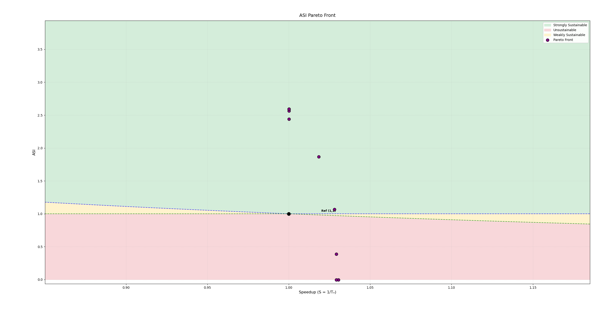

**Result:**

Total sniper runs: 24
Final hypervolume: 2.6384

**Front:**

| bpt | l1da | l1d | l1ia | l1i | l2a | l2 | l3a | l3 | nnbl | nnlr | robc | robd | robw | ASI | Speedup | Area | PeakPow | Region |
|---|---|---|---|---|---|---|---|---|---|---|---|---|---|---|---|---|---|---|
| pentium_m | 8 | 64 | 4 | 16 | 8 | 512 | 4 | 1024 | | | 8 | 10 | 1024 | -0.0056 | 1.0305 | 239.58 | 2631.93 | Unsustainable |
| pentium_m | 8 | 16 | 4 | 16 | 8 | 512 | 4 | 1024 | | | 8 | 10 | 1024 | -0.0054 | 1.0293 | 238.13 | 2631.81 | Unsustainable |
| tage | 4 | 32 | 4 | 64 | 8 | 512 | 8 | 2048 | | | 8 | 4 | 512 | 0.3855 | 1.0293 | 57.08 | 96.36 | Unsustainable |
| nn | 8 | 16 | 4 | 16 | 8 | 512 | 8 | 2048 | 32 | 0.0005 | 2 | 2 | 1024 | 1.0671 | 1.0281 | 53.81 | 35.68 | Strongly Sust. |
| tage | 4 | 32 | 4 | 64 | 8 | 512 | 8 | 2048 | | | 8 | 4 | 16 | 1.8672 | 1.0185 | 49.44 | 21.06 | Strongly Sust. |
| pentium_m | 4 | 16 | 8 | 16 | 4 | 256 | 4 | 2048 | | | 2 | 2 | 256 | 2.4405 | 1.0001 | 42.61 | 16.90 | Strongly Sust. |
| pentium_m | 4 | 16 | 4 | 64 | 4 | 256 | 4 | 2048 | | | 2 | 2 | 256 | 2.5637 | 1.0001 | 41.82 | 16.18 | Strongly Sust. |
| pentium_m | 4 | 16 | 4 | 16 | 4 | 256 | 4 | 2048 | | | 8 | 2 | 256 | 2.5931 | 1.0001 | 40.99 | 16.09 | Strongly Sust. |
| pentium_m | 4 | 16 | 4 | 16 | 4 | 256 | 4 | 2048 | | | 2 | 2 | 256 | 2.5931 | 1.0001 | 40.99 | 16.09 | Strongly Sust. |

### hyperparameter settings 2

hyperparameter settings: 400 candidate samples are used and 7 initial configurations have been run. 
#### 20 iterations

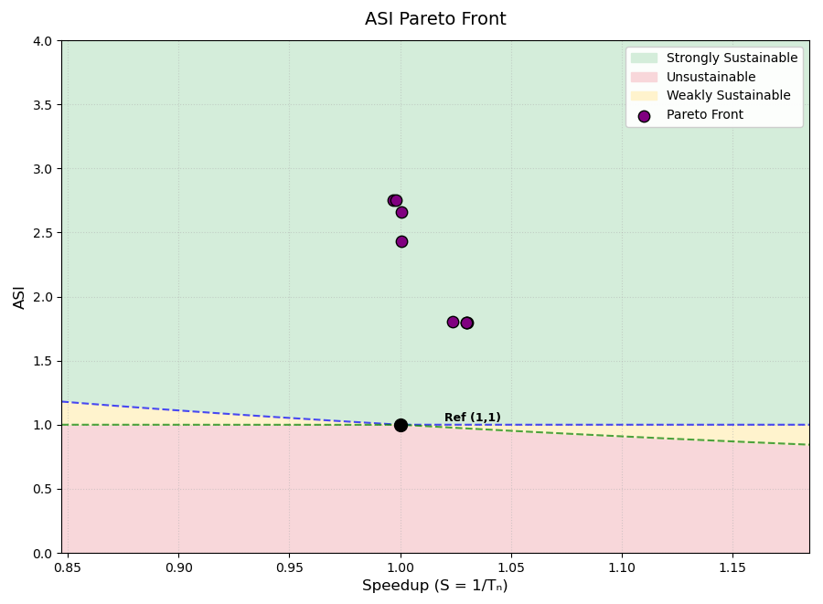

**Result:**

Total sniper runs: 26
Final hypervolume: 2.8076

**Front:**

| bpt | bp | l1da | l1d | l1ia | l1i | l2a | l2 | l3a | l3 | nhist | nnbl | nnlr | robc | robd | robw | ASI | Speedup | Area | PeakPow | Region |
|---|---|---|---|---|---|---|---|---|---|---|---|---|---|---|---|---|---|---|---|---|
| pentium_m | | 8 | 64 | 4 | 32 | 4 | 512 | 4 | 4096 | | | | 2 | 2 | 256 | 1.7997 | 1.0301 | 65.13 | 19.37 | Strongly Sust. |
| a53 | 512 | 8 | 64 | 4 | 32 | 4 | 512 | 4 | 4096 | 4 | | | 2 | 2 | 256 | 1.7998 | 1.0298 | 65.13 | 19.37 | Strongly Sust. |
| a53 | 512 | 8 | 64 | 4 | 32 | 4 | 512 | 4 | 4096 | 4 | | | 10 | 2 | 256 | 1.7998 | 1.0298 | 65.13 | 19.37 | Strongly Sust. |
| nn | | 8 | 64 | 4 | 32 | 4 | 512 | 4 | 4096 | | 16 | 0.001 | 2 | 2 | 256 | 1.8013 | 1.0235 | 65.13 | 19.35 | Strongly Sust. |
| pentium_m | | 4 | 32 | 8 | 16 | 4 | 256 | 4 | 2048 | | | | 2 | 2 | 256 | 2.4315 | 1.0005 | 42.80 | 16.94 | Strongly Sust. |
| pentium_m | | 4 | 32 | 8 | 16 | 4 | 256 | 4 | 1024 | | | | 2 | 2 | 256 | 2.6597 | 1.0005 | 35.85 | 16.23 | Strongly Sust. |
| nn | | 4 | 32 | 8 | 16 | 4 | 256 | 4 | 1024 | | 16 | 0.005 | 2 | 2 | 32 | 2.7519 | 0.9982 | 35.61 | 15.71 | Strongly Sust. |
| pentium_m | | 4 | 32 | 8 | 16 | 4 | 256 | 4 | 1024 | | | | 2 | 2 | 32 | 2.7531 | 0.9967 | 35.61 | 15.71 | Strongly Sust. |

#### 30 iterations

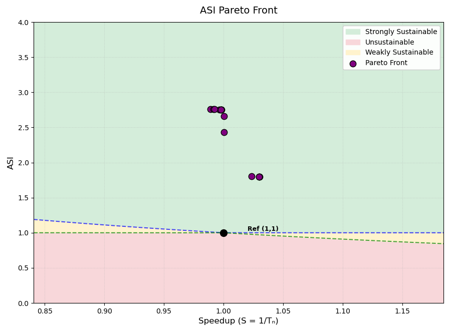

**Result:**

Total sniper runs: 36
Final hypervolume: 2.8132

**Front:**

| bpt | bp | l1da | l1d | l1ia | l1i | l2a | l2 | l3a | l3 | nhist | nnbl | nnlr | robc | robd | robw | ASI | Speedup | Area | PeakPow | Region |
|---|---|---|---|---|---|---|---|---|---|---|---|---|---|---|---|---|---|---|---|---|
| pentium_m | | 8 | 64 | 4 | 32 | 4 | 512 | 4 | 4096 | | | | 2 | 2 | 256 | 1.7997 | 1.0301 | 65.13 | 19.37 | Strongly Sust. |
| a53 | 512 | 8 | 64 | 4 | 32 | 4 | 512 | 4 | 4096 | 4 | | | 2 | 2 | 256 | 1.7998 | 1.0298 | 65.13 | 19.37 | Strongly Sust. |
| a53 | 512 | 8 | 64 | 4 | 32 | 4 | 512 | 4 | 4096 | 4 | | | 10 | 2 | 256 | 1.7998 | 1.0298 | 65.13 | 19.37 | Strongly Sust. |
| nn | | 8 | 64 | 4 | 32 | 4 | 512 | 4 | 4096 | | 16 | 0.001 | 2 | 2 | 256 | 1.8013 | 1.0235 | 65.13 | 19.35 | Strongly Sust. |
| pentium_m | | 4 | 32 | 8 | 16 | 4 | 256 | 4 | 2048 | | | | 2 | 2 | 256 | 2.4315 | 1.0005 | 42.80 | 16.94 | Strongly Sust. |
| pentium_m | | 4 | 32 | 8 | 16 | 4 | 256 | 4 | 1024 | | | | 2 | 2 | 256 | 2.6597 | 1.0005 | 35.85 | 16.23 | Strongly Sust. |
| nn | | 4 | 32 | 8 | 16 | 4 | 256 | 4 | 1024 | | 16 | 0.005 | 2 | 2 | 32 | 2.7519 | 0.9982 | 35.61 | 15.71 | Strongly Sust. |
| a53 | 2048 | 4 | 32 | 8 | 16 | 4 | 256 | 4 | 1024 | 4 | | | 2 | 2 | 32 | 2.7520 | 0.9980 | 35.61 | 15.71 | Strongly Sust. |
| tage | | 4 | 32 | 8 | 16 | 4 | 256 | 4 | 1024 | | | | 2 | 2 | 32 | 2.7522 | 0.9978 | 35.61 | 15.71 | Strongly Sust. |
| pentium_m | | 4 | 32 | 8 | 16 | 4 | 256 | 4 | 1024 | | | | 2 | 2 | 32 | 2.7531 | 0.9967 | 35.61 | 15.71 | Strongly Sust. |
| a53 | 1024 | 4 | 32 | 8 | 16 | 4 | 256 | 4 | 1024 | 2 | | | 2 | 2 | 32 | 2.7567 | 0.9923 | 35.61 | 15.68 | Strongly Sust. |
| nn | | 4 | 32 | 8 | 16 | 4 | 256 | 4 | 1024 | | 64 | 0.0005 | 2 | 2 | 32 | 2.7573 | 0.9915 | 35.61 | 15.68 | Strongly Sust. |
| nn | | 4 | 32 | 8 | 16 | 4 | 256 | 4 | 1024 | | 64 | 0.005 | 2 | 2 | 32 | 2.7587 | 0.9892 | 35.61 | 15.67 | Strongly Sust. |

#### 40 iterations

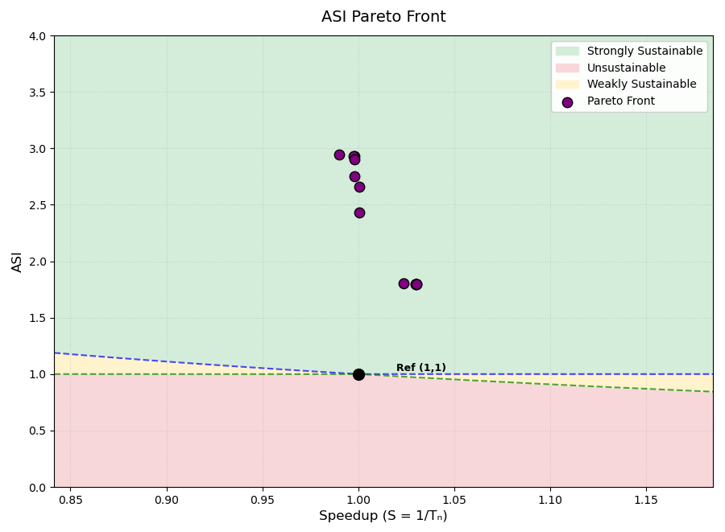

**Result:**

Total sniper runs: 46
Final hypervolume: 2.9982

**Front:**

| bpt | bp | l1da | l1d | l1ia | l1i | l2a | l2 | l3a | l3 | nhist | nnbl | nnlr | robc | robd | robw | ASI | Speedup | Area | PeakPow | Region |
|---|---|---|---|---|---|---|---|---|---|---|---|---|---|---|---|---|---|---|---|---|
| pentium_m | | 8 | 64 | 4 | 32 | 4 | 512 | 4 | 4096 | | | | 8 | 2 | 256 | 1.7997 | 1.0302 | 65.13 | 19.37 | Strongly Sust. |
| pentium_m | | 8 | 64 | 4 | 32 | 4 | 512 | 4 | 4096 | | | | 2 | 2 | 256 | 1.7997 | 1.0301 | 65.13 | 19.37 | Strongly Sust. |
| a53 | 512 | 8 | 64 | 4 | 32 | 4 | 512 | 4 | 4096 | 4 | | | 2 | 2 | 256 | 1.7998 | 1.0298 | 65.13 | 19.37 | Strongly Sust. |
| a53 | 512 | 8 | 64 | 4 | 32 | 4 | 512 | 4 | 4096 | 4 | | | 10 | 2 | 256 | 1.7998 | 1.0298 | 65.13 | 19.37 | Strongly Sust. |
| nn | | 8 | 64 | 4 | 32 | 4 | 512 | 4 | 4096 | | 16 | 0.001 | 2 | 2 | 256 | 1.8013 | 1.0235 | 65.13 | 19.35 | Strongly Sust. |
| pentium_m | | 4 | 32 | 8 | 16 | 4 | 256 | 4 | 2048 | | | | 2 | 2 | 256 | 2.4315 | 1.0005 | 42.80 | 16.94 | Strongly Sust. |
| pentium_m | | 4 | 32 | 8 | 16 | 4 | 256 | 4 | 1024 | | | | 2 | 2 | 256 | 2.6597 | 1.0005 | 35.85 | 16.23 | Strongly Sust. |
| nn | | 4 | 32 | 8 | 16 | 4 | 256 | 4 | 1024 | | 16 | 0.005 | 2 | 2 | 32 | 2.7519 | 0.9982 | 35.61 | 15.71 | Strongly Sust. |
| a53 | 2048 | 4 | 32 | 4 | 64 | 4 | 256 | 4 | 1024 | 4 | | | 2 | 2 | 32 | 2.8998 | 0.9981 | 34.82 | 14.99 | Strongly Sust. |
| a53 | 2048 | 4 | 32 | 4 | 16 | 4 | 256 | 4 | 1024 | 4 | | | 2 | 2 | 32 | 2.9337 | 0.9980 | 34.00 | 14.89 | Strongly Sust. |
| a53 | 1024 | 4 | 32 | 4 | 16 | 4 | 256 | 4 | 1024 | 4 | | | 2 | 2 | 32 | 2.9341 | 0.9975 | 34.00 | 14.89 | Strongly Sust. |
| a53 | 2048 | 4 | 32 | 4 | 64 | 4 | 256 | 4 | 1024 | 4 | | | 2 | 2 | 16 | 2.9440 | 0.9902 | 34.74 | 14.77 | Strongly Sust. |

#### 50 iterations

Mistake with automaticly plotting, but conclusion is that hypervolume keeps increasing, also for 60 iters it will even be higher (3.0375)

**Result:**

Total sniper runs: 56
Final hypervolume: 3.0285

**Front:**

50 iters:

| bpt | bp | l1da | l1d | l1ia | l1i | l2a | l2 | l3a | l3 | nhist | nnbl | nnlr | robc | robd | robw | ASI | Speedup | Area | PeakPow | Region |
|---|---|---|---|---|---|---|---|---|---|---|---|---|---|---|---|---|---|---|---|---|
| tage | | 8 | 64 | 8 | 16 | 4 | 512 | 4 | 4096 | | | | 8 | 2 | 1024 | 0.8705 | 1.0304 | 70.96 | 38.15 | Unsustainable |
| pentium_m | | 8 | 64 | 8 | 32 | 8 | 512 | 16 | 2048 | | | | 10 | 2 | 512 | 1.4025 | 1.0302 | 56.00 | 26.71 | Strongly Sust. |
| pentium_m | | 8 | 64 | 8 | 32 | 8 | 512 | 16 | 2048 | | | | 8 | 2 | 512 | 1.4025 | 1.0302 | 56.00 | 26.71 | Strongly Sust. |
| pentium_m | | 8 | 64 | 4 | 32 | 4 | 512 | 4 | 4096 | | | | 8 | 2 | 256 | 1.7997 | 1.0302 | 65.13 | 19.37 | Strongly Sust. |
| pentium_m | | 8 | 64 | 4 | 32 | 4 | 512 | 4 | 4096 | | | | 2 | 2 | 256 | 1.7997 | 1.0301 | 65.13 | 19.37 | Strongly Sust. |
| pentium_m | | 8 | 64 | 8 | 32 | 8 | 512 | 16 | 2048 | | | | 8 | 2 | 128 | 2.0450 | 1.0299 | 54.39 | 18.54 | Strongly Sust. |
| pentium_m | | 4 | 32 | 8 | 16 | 4 | 256 | 4 | 2048 | | | | 2 | 2 | 256 | 2.4315 | 1.0005 | 42.80 | 16.94 | Strongly Sust. |
| pentium_m | | 4 | 32 | 8 | 16 | 4 | 256 | 4 | 1024 | | | | 2 | 2 | 256 | 2.6597 | 1.0005 | 35.85 | 16.23 | Strongly Sust. |
| nn | | 4 | 32 | 8 | 16 | 4 | 256 | 4 | 1024 | | 16 | 0.005 | 2 | 2 | 32 | 2.7519 | 0.9982 | 35.61 | 15.71 | Strongly Sust. |
| a53 | 2048 | 4 | 32 | 4 | 64 | 4 | 256 | 4 | 1024 | 4 | | | 2 | 2 | 32 | 2.8998 | 0.9981 | 34.82 | 14.99 | Strongly Sust. |
| a53 | 2048 | 4 | 32 | 4 | 16 | 4 | 256 | 4 | 1024 | 4 | | | 2 | 2 | 32 | 2.9337 | 0.9980 | 34.00 | 14.89 | Strongly Sust. |
| a53 | 1024 | 4 | 32 | 4 | 16 | 4 | 256 | 4 | 1024 | 4 | | | 2 | 2 | 32 | 2.9341 | 0.9975 | 34.00 | 14.89 | Strongly Sust. |
| a53 | 2048 | 4 | 32 | 4 | 64 | 4 | 256 | 4 | 1024 | 4 | | | 2 | 2 | 16 | 2.9440 | 0.9902 | 34.74 | 14.77 | Strongly Sust. |
| pentium_m | | 4 | 32 | 4 | 64 | 4 | 256 | 4 | 1024 | | | | 2 | 2 | 16 | 2.9461 | 0.9874 | 34.74 | 14.76 | Strongly Sust. |
| nn | | 4 | 32 | 4 | 64 | 4 | 256 | 4 | 1024 | | 64 | 0.001 | 2 | 2 | 16 | 2.9679 | 0.9577 | 34.74 | 14.65 | Strongly Sust. |

60 iters:

| bpt | bp | l1da | l1d | l1ia | l1i | l2a | l2 | l3a | l3 | nhist | nnbl | nnlr | robc | robd | robw | ASI | Speedup | Area | PeakPow | Region |
|---|---|---|---|---|---|---|---|---|---|---|---|---|---|---|---|---|---|---|---|---|
| tage | | 8 | 64 | 8 | 16 | 4 | 512 | 4 | 4096 | | | | 8 | 2 | 1024 | 0.8705 | 1.0304 | 70.96 | 38.15 | Unsustainable |
| pentium_m | | 8 | 64 | 8 | 32 | 8 | 512 | 16 | 2048 | | | | 10 | 2 | 512 | 1.4025 | 1.0302 | 56.00 | 26.71 | Strongly Sust. |
| pentium_m | | 8 | 64 | 8 | 32 | 8 | 512 | 16 | 2048 | | | | 8 | 2 | 512 | 1.4025 | 1.0302 | 56.00 | 26.71 | Strongly Sust. |
| pentium_m | | 8 | 64 | 4 | 32 | 4 | 512 | 4 | 4096 | | | | 8 | 2 | 256 | 1.7997 | 1.0302 | 65.13 | 19.37 | Strongly Sust. |
| pentium_m | | 8 | 64 | 4 | 32 | 4 | 512 | 4 | 4096 | | | | 2 | 2 | 256 | 1.7997 | 1.0301 | 65.13 | 19.37 | Strongly Sust. |
| pentium_m | | 8 | 64 | 8 | 32 | 8 | 512 | 16 | 2048 | | | | 8 | 2 | 128 | 2.0450 | 1.0299 | 54.39 | 18.54 | Strongly Sust. |
| a53 | 2048 | 8 | 32 | 4 | 64 | 4 | 512 | 16 | 1024 | 4 | | | 8 | 2 | 64 | 2.3621 | 1.0287 | 47.90 | 16.83 | Strongly Sust. |
| pentium_m | | 4 | 32 | 8 | 16 | 4 | 256 | 4 | 2048 | | | | 2 | 2 | 256 | 2.4315 | 1.0005 | 42.80 | 16.94 | Strongly Sust. |
| pentium_m | | 4 | 32 | 8 | 16 | 4 | 256 | 4 | 1024 | | | | 2 | 2 | 256 | 2.6597 | 1.0005 | 35.85 | 16.23 | Strongly Sust. |
| nn | | 4 | 32 | 8 | 16 | 4 | 256 | 4 | 1024 | | 16 | 0.005 | 2 | 2 | 32 | 2.7519 | 0.9982 | 35.61 | 15.71 | Strongly Sust. |
| a53 | 2048 | 4 | 32 | 4 | 64 | 4 | 256 | 4 | 1024 | 4 | | | 2 | 2 | 32 | 2.8998 | 0.9981 | 34.82 | 14.99 | Strongly Sust. |
| a53 | 2048 | 4 | 32 | 4 | 16 | 4 | 256 | 4 | 1024 | 4 | | | 2 | 2 | 32 | 2.9337 | 0.9980 | 34.00 | 14.89 | Strongly Sust. |
| a53 | 1024 | 4 | 32 | 4 | 16 | 4 | 256 | 4 | 1024 | 4 | | | 2 | 2 | 32 | 2.9341 | 0.9975 | 34.00 | 14.89 | Strongly Sust. |
| a53 | 2048 | 4 | 32 | 4 | 64 | 4 | 256 | 4 | 1024 | 4 | | | 2 | 2 | 16 | 2.9440 | 0.9902 | 34.74 | 14.77 | Strongly Sust. |
| pentium_m | | 4 | 32 | 4 | 64 | 4 | 256 | 4 | 1024 | | | | 8 | 2 | 16 | 2.9461 | 0.9874 | 34.74 | 14.76 | Strongly Sust. |
| pentium_m | | 4 | 32 | 4 | 64 | 4 | 256 | 4 | 1024 | | | | 2 | 2 | 16 | 2.9461 | 0.9874 | 34.74 | 14.76 | Strongly Sust. |
| a53 | 512 | 4 | 32 | 4 | 64 | 4 | 256 | 4 | 1024 | 4 | | | 2 | 2 | 16 | 2.9463 | 0.9871 | 34.74 | 14.76 | Strongly Sust. |
| nn | | 4 | 32 | 4 | 64 | 4 | 256 | 4 | 1024 | | 16 | 0.001 | 10 | 2 | 16 | 2.9521 | 0.9789 | 34.74 | 14.73 | Strongly Sust. |
| nn | | 4 | 32 | 4 | 64 | 4 | 256 | 4 | 1024 | | 16 | 0.001 | 2 | 2 | 16 | 2.9678 | 0.9580 | 34.74 | 14.65 | Strongly Sust. |
| nn | | 4 | 32 | 4 | 64 | 4 | 256 | 4 | 1024 | | 64 | 0.001 | 2 | 2 | 16 | 2.9679 | 0.9577 | 34.74 | 14.65 | Strongly Sust. |

# ML2, CCl, MIP and EI benchmarks:
ML2: L2 resident (depending on LFSR settings) linked list traversal

CCl: Impossible control with large basic blocks (potentially larger penalty)

MIP: Large Instruction Region -- Instruction cache Misses

EI: Integer Execution -- 8 Independent computations per iteration 
## MESMO

### hyperparameter settings 1

hyperparameter settings: 200 candidate samples are used and 5 initial configurations are ran. 20 iterations.

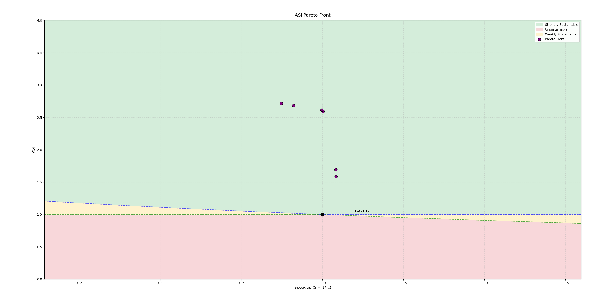

**Result:**

Total sniper runs: 24
Final hypervolume: 2.7310

**Front:**

| bpt | l1da | l1d | l1ia | l1i | l2a | l2 | l3a | l3 | nnbl | nnlr | robc | robd | robw | ASI | Speedup | Area | PeakPow | Region |
|---|---|---|---|---|---|---|---|---|---|---|---|---|---|---|---|---|---|---|
| pentium_m | 4 | 64 | 4 | 32 | 8 | 512 | 8 | 2048 | | | 2 | 2 | 512 | 1.5862 | 1.0085 | 48.11 | 25.86 | Strongly Sust. |
| pentium_m | 4 | 64 | 4 | 32 | 8 | 512 | 4 | 1024 | | | 2 | 2 | 512 | 1.6928 | 1.0083 | 42.91 | 25.13 | Strongly Sust. |
| pentium_m | 4 | 64 | 4 | 32 | 8 | 512 | 4 | 1024 | | | 2 | 2 | 32 | 2.5911 | 1.0004 | 41.18 | 16.62 | Strongly Sust. |
| pentium_m | 4 | 16 | 4 | 32 | 8 | 512 | 4 | 1024 | | | 2 | 2 | 32 | 2.6146 | 0.9998 | 40.81 | 16.51 | Strongly Sust. |
| nn | 8 | 16 | 4 | 32 | 8 | 256 | 4 | 1024 | 64 | 0.005 | 2 | 2 | 64 | 2.6838 | 0.9823 | 37.99 | 16.39 | Strongly Sust. |
| nn | 8 | 16 | 4 | 32 | 8 | 256 | 4 | 1024 | 64 | 0.005 | 2 | 2 | 32 | 2.7184 | 0.9747 | 37.93 | 16.19 | Strongly Sust. |

### hyperparameter settings 2

hyperparameter settings: 400 candidate samples are used and 5 initial configurations are ran. 20 iterations. 4 benchmarks: ML2, CCl, MIP and EI.

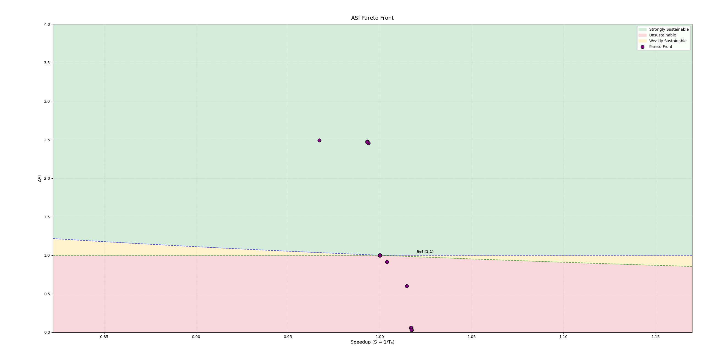

**Result:**

Total sniper runs: 26
Final hypervolume: 2.4945

**Front:**

| bpt | bp | l1da | l1d | l1ia | l1i | l2a | l2 | l3a | l3 | nhist | nnbl | nnlr | robc | robd | robw | ASI | Speedup | Area | PeakPow | Region |
|---|---|---|---|---|---|---|---|---|---|---|---|---|---|---|---|---|---|---|---|---|
| pentium_m | | 4 | 64 | 4 | 16 | 8 | 512 | 8 | 4096 | | | | 8 | 8 | 512 | 0.0267 | 1.0174 | 118.45 | 763.80 | Unsustainable |
| a53 | 512 | 8 | 64 | 8 | 16 | 8 | 512 | 16 | 1024 | 2 | | | 10 | 8 | 512 | 0.0310 | 1.0172 | 107.21 | 763.19 | Unsustainable |
| pentium_m | | 8 | 64 | 8 | 16 | 8 | 512 | 16 | 1024 | | | | 10 | 8 | 256 | 0.0572 | 1.0171 | 83.61 | 535.26 | Unsustainable |
| a53 | 512 | 8 | 64 | 8 | 16 | 8 | 512 | 16 | 1024 | 2 | | | 10 | 8 | 256 | 0.0572 | 1.0170 | 83.61 | 535.26 | Unsustainable |
| a53 | 512 | 4 | 64 | 8 | 16 | 8 | 512 | 16 | 1024 | 2 | | | 10 | 8 | 256 | 0.0597 | 1.0170 | 79.19 | 534.47 | Unsustainable |
| pentium_m | | 8 | 64 | 4 | 32 | 8 | 512 | 8 | 1024 | | | | 2 | 10 | 64 | 0.6014 | 1.0147 | 63.70 | 60.61 | Unsustainable |
| tage | | 8 | 64 | 4 | 16 | 4 | 512 | 8 | 1024 | | | | 10 | 8 | 32 | 0.9122 | 1.0039 | 56.76 | 42.19 | Unsustainable |
| baseline | | | | | | | | | | | | | | | | 1.0000 | 1.0000 | 94.01 | 27.56 | Reference |
| pentium_m | | 4 | 64 | 8 | 16 | 4 | 256 | 4 | 2048 | | | | 2 | 2 | 64 | 2.4560 | 0.9938 | 42.80 | 17.34 | Strongly Sust. |
| pentium_m | | 4 | 16 | 8 | 32 | 4 | 256 | 4 | 2048 | | | | 2 | 2 | 64 | 2.4675 | 0.9931 | 42.78 | 17.26 | Strongly Sust. |
| pentium_m | | 4 | 16 | 8 | 16 | 4 | 256 | 4 | 2048 | | | | 2 | 2 | 64 | 2.4779 | 0.9931 | 42.43 | 17.23 | Strongly Sust. |
| nn | | 4 | 16 | 8 | 32 | 4 | 256 | 4 | 2048 | | 64 | 0.005 | 2 | 2 | 64 | 2.4940 | 0.9671 | 42.78 | 17.07 | Strongly Sust. |

### hyperparameter settings 3

hyperparameter settings: 400 candidate samples are used and 7 initial configurations are ran. 

## 20 iterations

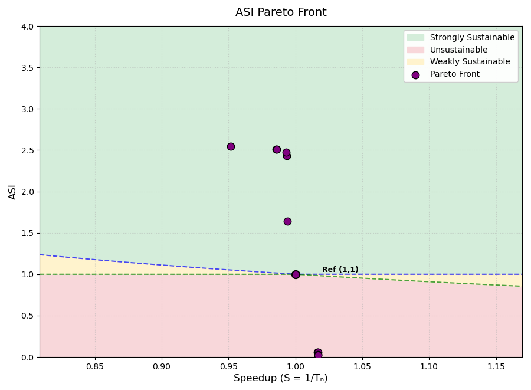

**Result:**

Total sniper runs: 26
Final hypervolume: 2.5351

**Front:**

| bpt | bp | l1da | l1d | l1ia | l1i | l2a | l2 | l3a | l3 | nhist | nnbl | nnlr | robc | robd | robw | ASI | Speedup | Area | PeakPow | Region |
|---|---|---|---|---|---|---|---|---|---|---|---|---|---|---|---|---|---|---|---|---|
| a53 | 2048 | 8 | 32 | 8 | 32 | 4 | 512 | 8 | 2048 | 4 | | | 8 | 10 | 256 | 0.0244 | 1.0170 | 105.00 | 997.11 | Unsustainable |
| pentium_m | | 8 | 32 | 4 | 16 | 8 | 512 | 8 | 2048 | | | | 8 | 8 | 512 | 0.0306 | 1.0169 | 108.38 | 762.95 | Unsustainable |
| a53 | 1024 | 8 | 64 | 8 | 16 | 8 | 512 | 8 | 1024 | 3 | | | 10 | 8 | 256 | 0.0583 | 1.0169 | 81.53 | 535.21 | Unsustainable |
| a53 | 1024 | 8 | 16 | 8 | 16 | 8 | 512 | 8 | 1024 | 3 | | | 10 | 8 | 256 | 0.0591 | 1.0163 | 80.08 | 535.08 | Unsustainable |
| baseline | | | | | | | | | | | | | | | | 1.0000 | 1.0000 | 94.01 | 27.56 | Reference |
| pentium_m | | 4 | 64 | 8 | 16 | 4 | 256 | 4 | 2048 | | | | 2 | 2 | 512 | 1.6414 | 0.9940 | 44.46 | 25.64 | Strongly Sust. |
| pentium_m | | 4 | 16 | 8 | 16 | 4 | 256 | 4 | 2048 | | | | 2 | 2 | 256 | 2.4282 | 0.9933 | 42.61 | 17.56 | Strongly Sust. |
| pentium_m | | 4 | 16 | 8 | 16 | 4 | 256 | 4 | 2048 | | | | 2 | 2 | 64 | 2.4777 | 0.9933 | 42.43 | 17.23 | Strongly Sust. |
| tage | | 4 | 16 | 8 | 16 | 4 | 256 | 4 | 2048 | | | | 2 | 2 | 32 | 2.5100 | 0.9862 | 42.37 | 17.01 | Strongly Sust. |
| pentium_m | | 4 | 16 | 8 | 16 | 4 | 256 | 4 | 2048 | | | | 2 | 2 | 32 | 2.5104 | 0.9857 | 42.37 | 17.01 | Strongly Sust. |
| nn | | 4 | 16 | 8 | 16 | 4 | 256 | 4 | 2048 | | 64 | 0.001 | 2 | 2 | 32 | 2.5457 | 0.9516 | 42.37 | 16.77 | Strongly Sust. |

## 100 iterations

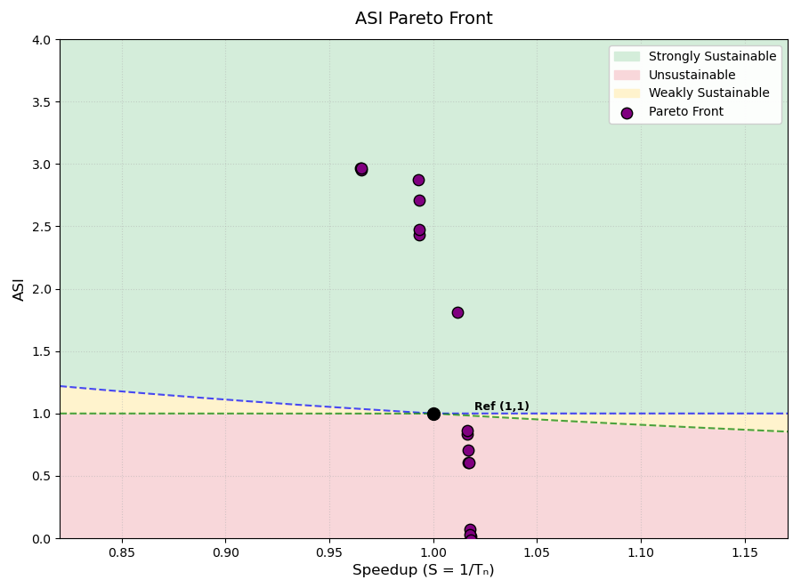

**Result:**

Total sniper runs: 106
Final hypervolume: 2.9794

**Front:**

| bpt | bp | l1da | l1d | l1ia | l1i | l2a | l2 | l3a | l3 | nhist | nnbl | nnlr | robc | robd | robw | ASI | Speedup | Area | PeakPow | Region |
|---|---|---|---|---|---|---|---|---|---|---|---|---|---|---|---|---|---|---|---|---|
| tage | | 4 | 64 | 8 | 16 | 4 | 512 | 16 | 8192 | | | | 8 | 10 | 1024 | -0.0112 | 1.0180 | 288.40 | 2638.40 | Unsustainable |
| pentium_m | | 4 | 64 | 4 | 64 | 8 | 512 | 8 | 1024 | | | | 10 | 10 | 512 | 0.0115 | 1.0180 | 131.82 | 1434.20 | Unsustainable |
| pentium_m | | 8 | 64 | 4 | 64 | 8 | 512 | 16 | 1024 | | | | 8 | 10 | 256 | 0.0256 | 1.0177 | 101.17 | 995.75 | Unsustainable |
| pentium_m | | 8 | 64 | 4 | 64 | 8 | 512 | 16 | 1024 | | | | 8 | 10 | 128 | 0.0690 | 1.0175 | 78.77 | 464.46 | Unsustainable |
| a53 | 2048 | 4 | 64 | 8 | 32 | 8 | 512 | 16 | 1024 | 4 | | | 8 | 10 | 64 | 0.6029 | 1.0171 | 63.08 | 60.76 | Unsustainable |
| pentium_m | | 8 | 32 | 4 | 16 | 8 | 512 | 4 | 1024 | | | | 8 | 10 | 64 | 0.6048 | 1.0169 | 63.13 | 60.55 | Unsustainable |
| pentium_m | | 8 | 64 | 4 | 64 | 8 | 512 | 16 | 4096 | | | | 8 | 8 | 64 | 0.7077 | 1.0167 | 77.22 | 45.90 | Unsustainable |
| a53 | 512 | 4 | 32 | 8 | 64 | 8 | 512 | 4 | 2048 | 4 | | | 10 | 8 | 64 | 0.8359 | 1.0163 | 62.05 | 44.18 | Unsustainable |
| a53 | 1024 | 4 | 32 | 4 | 32 | 4 | 512 | 16 | 2048 | 4 | | | 10 | 8 | 64 | 0.8658 | 1.0163 | 59.92 | 43.38 | Unsustainable |
| a53 | 512 | 8 | 32 | 4 | 16 | 8 | 512 | 8 | 1024 | 2 | | | 2 | 4 | 64 | 1.8109 | 1.0115 | 48.09 | 22.65 | Strongly Sust. |
| pentium_m | | 4 | 16 | 8 | 16 | 4 | 256 | 4 | 2048 | | | | 2 | 2 | 256 | 2.4282 | 0.9933 | 42.61 | 17.56 | Strongly Sust. |
| pentium_m | | 4 | 16 | 8 | 16 | 4 | 256 | 4 | 2048 | | | | 2 | 2 | 64 | 2.4777 | 0.9933 | 42.43 | 17.23 | Strongly Sust. |
| pentium_m | | 4 | 16 | 8 | 16 | 4 | 256 | 4 | 1024 | | | | 2 | 2 | 64 | 2.7079 | 0.9931 | 35.48 | 16.52 | Strongly Sust. |
| a53 | 1024 | 4 | 32 | 4 | 16 | 4 | 256 | 4 | 1024 | 2 | | | 2 | 2 | 64 | 2.8713 | 0.9929 | 34.06 | 15.72 | Strongly Sust. |
| a53 | 512 | 4 | 64 | 4 | 16 | 4 | 256 | 4 | 1024 | 2 | | | 2 | 2 | 16 | 2.9494 | 0.9654 | 34.08 | 15.30 | Strongly Sust. |
| a53 | 1024 | 4 | 32 | 4 | 16 | 4 | 256 | 4 | 1024 | 2 | | | 2 | 2 | 16 | 2.9640 | 0.9653 | 33.91 | 15.24 | Strongly Sust. |
| a53 | 512 | 4 | 32 | 4 | 16 | 4 | 256 | 4 | 1024 | 2 | | | 2 | 2 | 16 | 2.9642 | 0.9651 | 33.91 | 15.24 | Strongly Sust. |

## SPEA2 - COLE

### Hyperparameter settings 1

Hyperparameter settings: Patience = 1 (amount of iterations to wait before stopping after no improvement), max_iterations: int = 10. (max iter never reached)

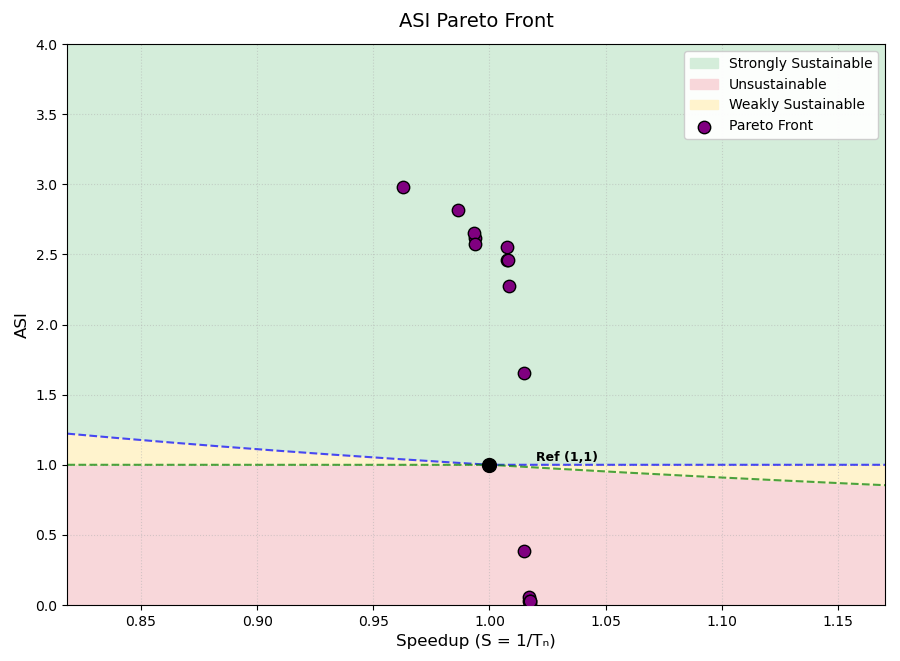

**Result:**

Total sniper runs: 146
Final hypervolume: 3.0042

**Front:**

| bpt | bp | l1da | l1d | l1ia | l1i | l2a | l2 | l3a | l3 | nhist | nnbl | nnlr | robc | robd | robw | ASI | Speedup | Area | PeakPow | Region |
|---|---|---|---|---|---|---|---|---|---|---|---|---|---|---|---|---|---|---|---|---|
| a53 | 2048 | 4 | 64 | 4 | 32 | 4 | 512 | 16 | 2048 | 3 | | | 8 | 10 | 512 | 0.0102 | 1.0176 | 138.09 | 1434.83 | Unsustainable |
| a53 | 2048 | 4 | 64 | 4 | 32 | 4 | 512 | 16 | 2048 | 3 | | | 8 | 10 | 256 | 0.0256 | 1.0174 | 100.93 | 995.54 | Unsustainable |
| pentium_m | | 4 | 32 | 4 | 32 | 8 | 512 | 16 | 2048 | | | | 10 | 10 | 256 | 0.0257 | 1.0174 | 100.85 | 995.53 | Unsustainable |
| a53 | 1024 | 8 | 64 | 8 | 32 | 8 | 512 | 8 | 1024 | 3 | | | 4 | 8 | 512 | 0.0317 | 1.0171 | 105.48 | 763.17 | Unsustainable |
| tage | | 4 | 32 | 8 | 32 | 4 | 512 | 16 | 4096 | | | | 10 | 10 | 128 | 0.0603 | 1.0170 | 92.12 | 466.61 | Unsustainable |
| a53 | 1024 | 4 | 64 | 8 | 32 | 8 | 512 | 4 | 2048 | 3 | | | 8 | 4 | 512 | 0.3832 | 1.0150 | 60.14 | 97.85 | Unsustainable |
| tage | | 8 | 64 | 4 | 32 | 4 | 512 | 8 | 2048 | | | | 4 | 4 | 128 | 1.6527 | 1.0150 | 53.96 | 23.78 | Strongly Sust. |
| pentium_m | | 4 | 64 | 4 | 64 | 4 | 512 | 16 | 2048 | | | | 8 | 2 | 256 | 2.2741 | 1.0084 | 48.86 | 17.94 | Strongly Sust. |
| pentium_m | | 4 | 64 | 4 | 32 | 8 | 512 | 16 | 1024 | | | | 8 | 2 | 256 | 2.4611 | 1.0082 | 43.49 | 17.22 | Strongly Sust. |
| pentium_m | | 4 | 16 | 4 | 64 | 8 | 512 | 16 | 1024 | | | | 2 | 2 | 256 | 2.4626 | 1.0077 | 43.71 | 17.18 | Strongly Sust. |
| a53 | 512 | 4 | 32 | 4 | 16 | 8 | 512 | 8 | 1024 | 3 | | | 4 | 2 | 128 | 2.5538 | 1.0074 | 40.89 | 16.89 | Strongly Sust. |
| pentium_m | | 8 | 32 | 4 | 64 | 4 | 256 | 4 | 1024 | | | | 4 | 2 | 256 | 2.5740 | 0.9936 | 39.32 | 16.94 | Strongly Sust. |
| tage | | 4 | 64 | 8 | 16 | 8 | 256 | 4 | 1024 | | | | 8 | 2 | 256 | 2.6172 | 0.9936 | 36.56 | 16.97 | Strongly Sust. |
| pentium_m | | 4 | 16 | 8 | 16 | 4 | 256 | 4 | 1024 | | | | 8 | 2 | 256 | 2.6515 | 0.9935 | 35.65 | 16.85 | Strongly Sust. |
| a53 | 512 | 4 | 32 | 4 | 32 | 4 | 128 | 16 | 1024 | 3 | | | 4 | 2 | 256 | 2.8159 | 0.9865 | 35.58 | 15.87 | Strongly Sust. |
| a53 | 512 | 4 | 16 | 4 | 32 | 8 | 128 | 16 | 1024 | 3 | | | 4 | 2 | 16 | 2.9808 | 0.9627 | 35.08 | 15.04 | Strongly Sust. |
